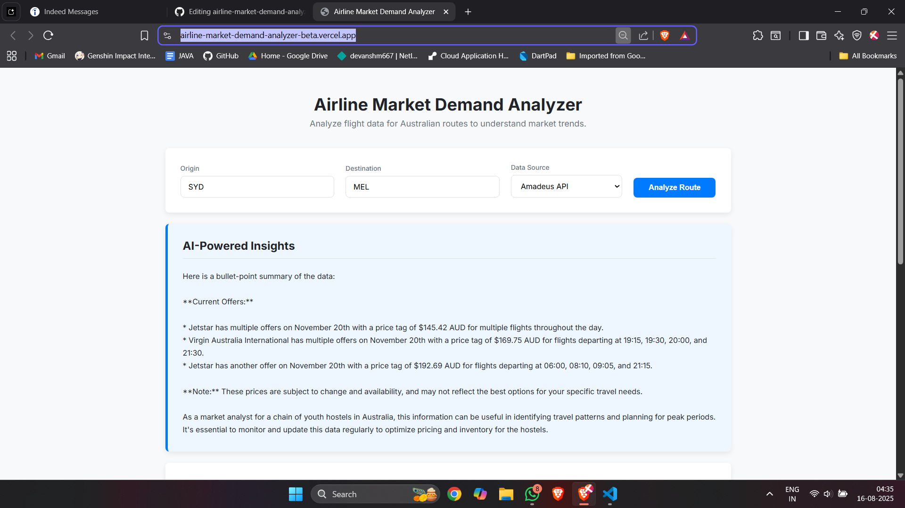
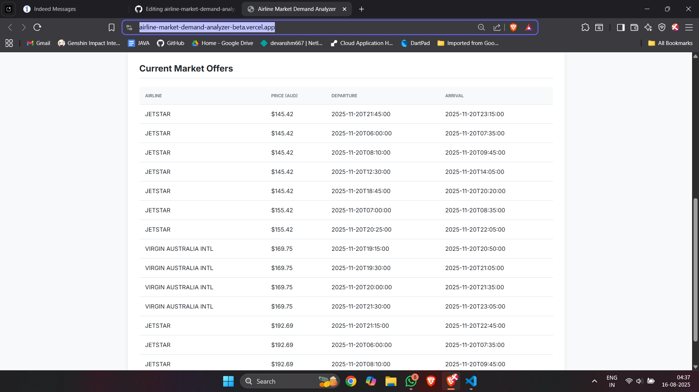

# Airline Market Demand Analyzer

**Live Demo:** [**https://airline-market-demand-analyzer-beta.vercel.app/**](https://airline-market-demand-analyzer-beta.vercel.app/)




## Overview

This project is a full-stack web application designed to analyze real-time market demand and pricing trends across global airline routes. It provides actionable market intelligence by aggregating live flight offers via SerpApi (Google Flights) and generating analyst-grade AI summaries using Groq (Llama 3.1). Non-technical stakeholders and travel operators can rapidly assess competitive pricing, peak departure windows, and route viability.

The application emphasizes production resilience, payload optimization, and clean data pipelines to deliver an intuitive, responsive user experience.

## Core Features

- 🚀 **Real-Time Flight Aggregation:** Scrapes live Google Flights data via SerpApi to deliver current market offers, flight durations, departure/arrival schedules, and travel class details.
- 🧠 **AI-Powered Market Insights:** Processes extracted flight offers with Groq (Llama 3.1 8B) to generate actionable bullet-point summaries identifying lowest fares, optimal departure slots, and route price competitiveness.
- 📊 **Trend Visualization:** Visualizes forward-looking price trajectory over time using Chart.js to highlight high- and low-demand booking windows.
- 🛡️ **Defensive Engineering & Payload Trimming:** Prevents payload overflow (`413 Request Entity Too Large`) through backend trend downsampling, prevents AI hallucinations via frontend empty-state guard clauses, and normalizes nested data structures reliably.
- 🎨 **Modern Interface:** A clean, responsive UI built with modern CSS variables, accessible card layouts, dynamic HTML parsing for LLM outputs, and real-time state feedback.

## Tech Stack

| Category | Technology |
| --- | --- |
| **Frontend** | `HTML5`, `CSS3`, `Vanilla JavaScript (ES6+)`, `Chart.js` |
| **Backend** | `Python 3`, `FastAPI`, `Uvicorn` |
| **Data Engine** | `SerpApi` (Google Flights Engine) |
| **AI / LLM** | `Groq API` (`groq/compound`) |
| **Deployment** | **Backend:** `Render` <br> **Frontend:** `Vercel` |
| **Tooling** | `Git`, `GitHub`, `VS Code`, `python-dotenv` |

## Getting Started Locally

### 1. Prerequisites

- Python 3.8+
- Git installed on your system
- A modern web browser

### 2. Clone the Repository

```bash
git clone [https://github.com/devanshmayatra/airline-market-demand-analyzer.git](https://github.com/devanshmayatra/airline-market-demand-analyzer.git)
cd airline-market-demand-analyzer
```

### 3. Set Up the Backend

1. **Create and activate a Python virtual environment:**

   ```bash
   # macOS / Linux
   python3 -m venv venv
   source venv/bin/activate

   # Windows
   python -m venv venv
   .\venv\Scripts\activate
   ```

2. **Install dependencies:**

   ```bash
   pip install -r requirements.txt
   ```

3. **Configure environment variables:**

   Create a `.env` file in the project root:

   ```env
   GROQ_API_KEY="your_groq_api_key"
   SERPAPI_API_KEY="your_serpapi_api_key"
   ```

4. **Start the FastAPI server:**

   ```bash
   uvicorn main:app --reload --port 8001
   ```

   The backend API will be available at `http://127.0.0.1:8001`.

### 4. Run the Frontend

1. Ensure the `API_BASE_URL` in `script.js` points to your local server:
   ```javascript
   const API_BASE_URL = "[http://127.0.0.1:8001](http://127.0.0.1:8001)";
   ```
2. Serve the `index.html` file using VS Code **Live Server** or any static file server:
   ```bash
   # Optional: quick local server via Python
   python -m http.server 5500
   ```
3. Open `http://127.0.0.1:5500` in your browser.

## Deployment

- **Backend (Render):** Deployed as a web service running FastAPI via Uvicorn. Environment keys (`GROQ_API_KEY`, `SERPAPI_API_KEY`) are managed securely within Render's dashboard.
- **Frontend (Vercel):** Deployed as an optimized static site. `API_BASE_URL` routes directly over HTTPS to the deployed Render service to prevent Private Network Access (PNA) security blocks.

## Key Technical Learnings

- **Payload Optimization (413 Prevention):** LLM context limits and rate limits triggered `413 Request Entity Too Large` errors when full multi-month flight trend arrays were transmitted. The backend pipeline was re-architected to trim and sample the flight trend data prior to LLM submission.
- **Handling Hallucinations on Empty States:** If scrapers returned zero results for obscure dates, LLMs risked generating plausible-sounding but fictional offers. A frontend guard clause immediately bypasses the inference API and displays a clean fallback message when `offers.length === 0`.
- **Markdown-to-DOM Normalization:** LLM outputs frequently alternate between raw asterisks, nested dashes, and inconsistent markdown tags. Implemented global JavaScript string tokenizers and regex sanitizers to cleanly convert nested Markdown into semantic `<ul><li>` structures and `<strong>` tags.
